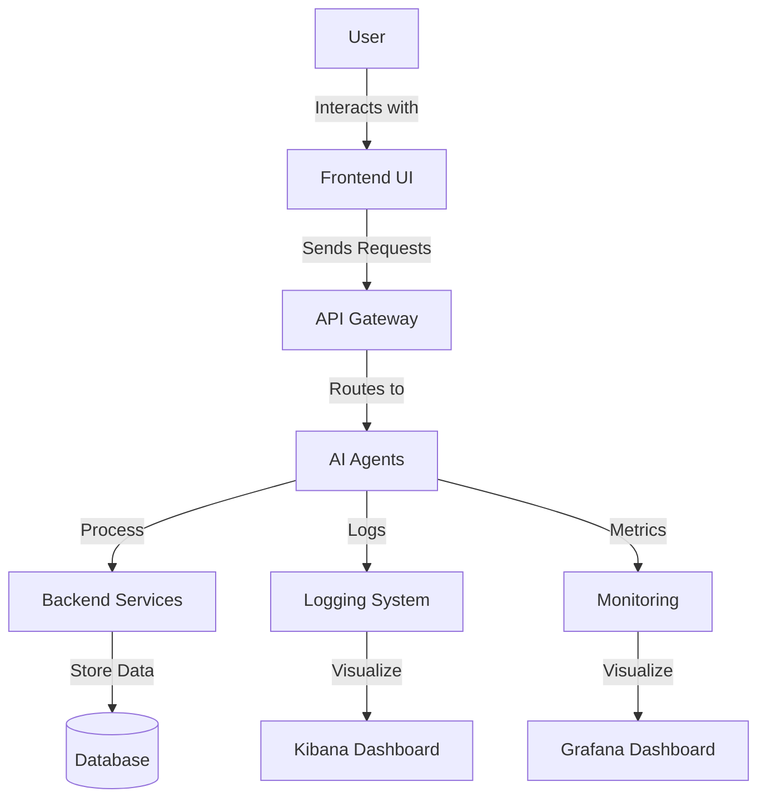

# AI Development Workflow Platform

A comprehensive AI-powered development workflow platform that automates the software development lifecycle using a microservices architecture. This project demonstrates modern web development practices, containerization, and CI/CD integration.


## ✨ Features

- **Interactive Chat Interface**: Natural language interaction with AI agents
- **Agent Management**: Monitor and control specialized AI agents
- **Workflow Visualization**: Real-time progress tracking of development workflows
- **Responsive Design**: Works on desktop and mobile devices
- **Dark/Light Mode**: Toggle between themes for comfortable viewing
- **Comprehensive Logging**: Detailed system logs for debugging and monitoring
- **Modern Tech Stack**: Built with React, Material-UI, and Docker

## 🚀 Architecture Overview



### Core Components

1. **Frontend**
   - React-based responsive UI
   - Real-time updates using WebSockets
   - Interactive workflow visualization

2. **Backend Services**
   - Microservices architecture
   - RESTful APIs
   - Message queue for inter-service communication

3. **AI Agents**
   - Specialized agents for different development tasks
   - Asynchronous processing
   - Progress tracking

4. **Monitoring & Logging**
   - Prometheus for metrics
   - Grafana for visualization
   - ELK Stack for logging

## 🛠️ Prerequisites

- Docker 20.10.0+
- Docker Compose 1.29.0+
- Node.js 16.0.0+ (for development)
- npm 8.0.0+ or yarn 1.22.0+

## 🚀 Quick Start

1. **Clone the repository**
   ```bash
   git clone https://github.com/your-username/ai_dev_workflow.git
   cd ai_dev_workflow
   ```

2. **Configure environment variables**
   Create a `.env` file in the project root:
   ```env
   # Required
   NODE_ENV=development
   REACT_APP_API_URL=http://localhost:5000
   
   # Optional
   REACT_APP_GA_TRACKING_ID=UA-XXXXX-Y
   ```

3. **Start the application**
   ```bash
   # Using Docker Compose (recommended)
   docker-compose up -d
   
   # Or for development
   cd frontend/my-app
   npm install
   npm start
   ```

4. **Access the application**
   - Frontend: http://localhost:3000
   - API Documentation: http://localhost:5000/api-docs
   - Monitoring: http://localhost:9090 (Prometheus)
   - Logs: http://localhost:5601 (Kibana)
   - Metrics: http://localhost:3001 (Grafana)

## 🧩 Project Structure

```
ai_dev_workflow/
├── frontend/                  # React frontend application
│   └── my-app/
│       ├── public/           # Static files
│       └── src/               # React source code
│           ├── components/    # Reusable UI components
│           ├── theme/         # Theme configuration
│           ├── App.js         # Main component
│           └── index.js       # Entry point
│
├── api_gateway_agent/        # API Gateway service
├── approval_agent/            # Approval workflow service
├── backend_microservices_agent/# Backend logic service
├── database_schema_agent/      # Database management
├── deployment_automation_agent/# Deployment automation
├── frontend_components_agent/  # Frontend component generation
├── requirement_analysis_agent/ # Requirements analysis
├── requirement_gathering_agent/# Initial requirements collection
└── sprint_planning_agent/     # Sprint planning logic

# Infrastructure
├── docker/                    # Docker configuration
├── grafana/                   # Grafana dashboards
├── jenkins/                   # CI/CD pipelines
├── kibana/                    # Kibana configurations
├── logging/                   # Logging setup
└── prometheus/               # Monitoring configuration

# Configuration
├── .env.example              # Example environment variables
├── docker-compose.yml        # Docker Compose configuration
├── Jenkinsfile               # CI/CD pipeline
└── README.md                # Project documentation
```

## 🧪 Development

### Frontend Development

```bash
cd frontend/my-app
npm install       # Install dependencies
npm start         # Start development server
npm test          # Run tests
npm run build     # Create production build
```

### Backend Development

```bash
# Start all services
docker-compose up -d

# View logs
docker-compose logs -f

# Run tests
cd <service_directory>
npm test
```

## 🤝 Contributing

1. Fork the repository
2. Create your feature branch (`git checkout -b feature/AmazingFeature`)
3. Commit your changes (`git commit -m 'Add some AmazingFeature'`)
4. Push to the branch (`git push origin feature/AmazingFeature`)
5. Open a Pull Request

## 📄 License

This project is licensed under the MIT License - see the [LICENSE](LICENSE) file for details.

## 🎉 Acknowledgments

- [Material-UI](https://mui.com/) for the amazing React components
- [Create React App](https://create-react-app.dev/) for the project bootstrapping
- [Docker](https://www.docker.com/) for containerization
- [Prometheus](https://prometheus.io/) and [Grafana](https://grafana.com/) for monitoring

---

<div align="center">
  Made with ❤️ by Aditya Srivastava
</div>
