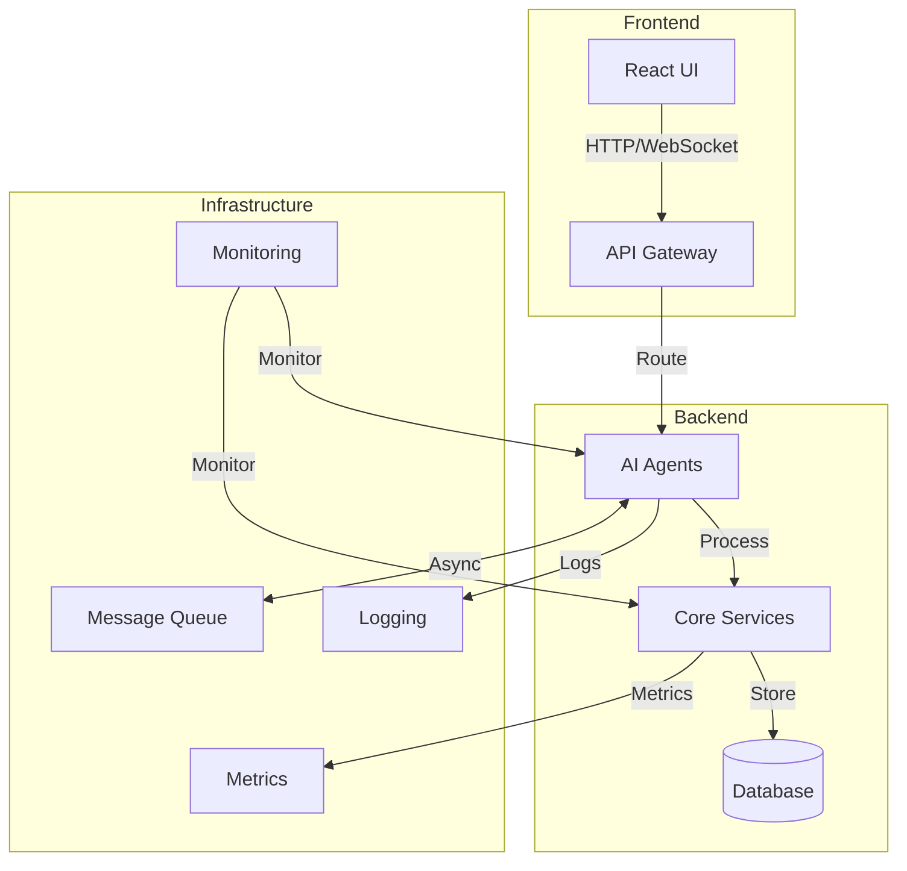

# AI Development Workflow - Architecture Documentation

## Table of Contents
1. [System Overview](#system-overview)
2. [Architecture Diagram](#architecture-diagram)
3. [Component Details](#component-details)
4. [Data Flow](#data-flow)
5. [API Specifications](#api-specifications)
6. [Deployment Architecture](#deployment-architecture)
7. [Security Considerations](#security-considerations)
8. [Scalability](#scalability)
9. [Monitoring and Logging](#monitoring-and-logging)
10. [Future Enhancements](#future-enhancements)

## System Overview

The AI Development Workflow platform is a microservices-based application designed to automate and streamline the software development lifecycle using AI agents. The system is built with scalability, maintainability, and extensibility in mind.

### Key Characteristics
- **Modular Architecture**: Independent services with well-defined interfaces
- **Event-Driven**: Asynchronous communication between components
- **Containerized**: Docker-based deployment for consistency
- **Horizontally Scalable**: Designed to handle increased load
- **Observability**: Built-in monitoring, logging, and tracing

## Architecture Diagram



## Component Details

### 1. Frontend
- **Technology Stack**: React, Material-UI, Redux, WebSocket
- **Key Features**:
  - Real-time updates
  - Responsive design
  - Interactive workflow visualization
  - Dark/light theme support

### 2. API Gateway
- **Purpose**: Single entry point for all client requests
- **Features**:
  - Request routing
  - Authentication/Authorization
  - Rate limiting
  - Request/Response transformation
  - API versioning

### 3. AI Agents

#### 3.1 Requirement Gathering Agent
- **Purpose**: Collect and process project requirements
- **Input**: Natural language requirements
- **Output**: Structured requirements

#### 3.2 Requirement Analysis Agent
- **Purpose**: Analyze and refine requirements
- **Input**: Structured requirements
- **Output**: Technical specifications

#### 3.3 Frontend Components Agent
- **Purpose**: Generate UI components
- **Input**: Design specifications
- **Output**: React components

#### 3.4 Backend Microservices Agent
- **Purpose**: Develop backend services
- **Input**: API specifications
- **Output**: Microservice code

#### 3.5 Database Schema Agent
- **Purpose**: Design database schemas
- **Input**: Data requirements
- **Output**: Database schema definitions

#### 3.6 Testing Agent
- **Purpose**: Generate and run tests
- **Input**: Codebase
- **Output**: Test cases and results

#### 3.7 Deployment Agent
- **Purpose**: Handle deployments
- **Input**: Build artifacts
- **Output**: Deployed services

### 4. Core Services

#### 4.1 Authentication Service
- JWT-based authentication
- Role-based access control
- Session management

#### 4.2 Project Management Service
- Project lifecycle management
- Task tracking
- Team collaboration

#### 4.3 Workflow Engine
- Define and execute workflows
- State management
- Error handling

## Data Flow

1. **User Interaction**
   - User submits requirements via the web interface
   - Request is authenticated and routed to the appropriate service

2. **Processing**
   - Requirements are processed by AI agents
   - Agents communicate asynchronously via message queue
   - Progress is tracked and updated in real-time

3. **Persistence**
   - Data is stored in appropriate databases
   - Audit logs are maintained
   - Metrics are collected for monitoring

4. **Response**
   - Results are streamed back to the UI
   - Notifications are sent for important events
   - Workflow progress is updated

## API Specifications

The system exposes RESTful APIs with the following characteristics:

### Base URL
```
https://api.aidevworkflow.com/v1
```

### Authentication
```http
Authorization: Bearer <jwt_token>
```

### Endpoints

#### Projects
- `GET /projects` - List all projects
- `POST /projects` - Create new project
- `GET /projects/{id}` - Get project details
- `PUT /projects/{id}` - Update project
- `DELETE /projects/{id}` - Delete project

#### Agents
- `GET /agents` - List all agents
- `GET /agents/{id}/status` - Get agent status
- `POST /agents/{id}/start` - Start agent
- `POST /agents/{id}/stop` - Stop agent

#### Workflows
- `GET /workflows` - List workflows
- `POST /workflows` - Create workflow
- `GET /workflows/{id}` - Get workflow details
- `POST /workflows/{id}/execute` - Execute workflow

## Deployment Architecture

### Development Environment
- Local Docker Compose setup
- Hot-reloading for development
- Local database instances

### Staging/Production
- Kubernetes cluster
- Container registry
- CI/CD pipeline
- Blue/green deployments
- Auto-scaling

## Security Considerations

### Authentication & Authorization
- JWT-based authentication
- Role-based access control (RBAC)
- Token expiration and refresh

### Data Protection
- Encryption at rest and in transit
- Secure secret management
- Regular security audits

### API Security
- Rate limiting
- Input validation
- CORS configuration
- CSRF protection

## Scalability

### Horizontal Scaling
- Stateless services
- Load balancing
- Caching strategies

### Database Scaling
- Read replicas
- Sharding
- Connection pooling

### Message Queue
- Distributed message broker
- Dead letter queues
- Message retention policies

## Monitoring and Logging

### Metrics Collection
- Prometheus for metrics collection
- Custom metrics for business KPIs
- Alerting rules

### Logging
- Centralized logging with ELK stack
- Structured logging format
- Log rotation and retention

### Tracing
- Distributed tracing with Jaeger
- Performance monitoring
- Dependency analysis

## Future Enhancements

### Short-term
- [ ] Enhanced AI model training
- [ ] Additional integration options
- [ ] More template options

### Long-term
- [ ] Auto-scaling based on load
- [ ] Advanced analytics dashboard
- [ ] Marketplace for AI agents

## Conclusion

This architecture provides a robust foundation for the AI Development Workflow platform, enabling efficient development, deployment, and scaling of AI-powered development tools. The modular design allows for easy extension and maintenance as the platform evolves.
